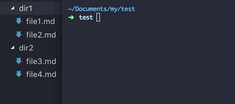

English | [한국어](README-KR.md)

# markdown_navigator

**markdown_navigator** creates a link to quickly navigate to all the files in your directory.

Use it to quickly create index where markdown is used, such as "github".




## Installation 
```bash
$ npm install -g markdown_navigator
```
## Usage
```bash
$ mdnv create <directory> [options]
```
```bash
Usage: create <directory> [options]

creates a index.md to quickly navigate to all the files in your directory.

Options:
  -n, --name [name]  The name of the index file to be created. (default: "index")
  -h, --help         output usage information

  Examples:

    $ mdnv create ./directory
    $ mdnv create ./directory -n navi
```


### Basic
If only the default command is entered,  
creates a 'index.md' for all files within the currently located directory.
```bash
$ mdnv create
```


### Example  
**example directory**
```bash
test_directory
|-- file1.md
|-- dir1
|   |-- file2.md
|   |-- file3.md
|-- dir2
|   |-- file4.md
|   |-- file5.md
```
<br/>

**basic example**
```bash
$ cd test_directory/
$ mdnv create ./
```
`index.md` is created with the following contents.
```bash
[file1.md](/file1.md)  
[file2.md](/dir1/file2.md)  
[file3.md](/dir1/file3.md)  
[file4.md](/dir2/file4.md)  
[file5.md](/dir2/file5.md)
```
<br/>  

**option example**  
This is an example of adding `directory` and `-n` options.
```bash
$ cd test_directory/
$ mdnv create ./dir1 -n menu
```
`menu.md` is created with the following contents.
```bash
[file2.md](/dir1/file2.md)
[file3.md](/dir1/file3.md)
```

## TODO
- enter multiple directory path
```bash
$ mdnv create ./dir1 ./dir2
```
```bash
[file2.md](/dir1/file2.md)
[file3.md](/dir1/file3.md)
[file4.md](/dir2/file4.md)
[file5.md](/dir2/file5.md)
```

- path option to index file to be created
```bash
$ mdnv create ./dir1 -p ./other_directory
```

## Version

**current verstion : 0.3.0**  

[change log](CHANGELOG.md)

## License

Licensed under [MIT License](LICENSE). © minung.han
